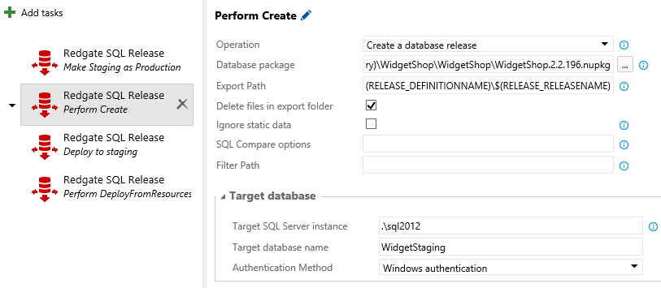

# Redgate SQL Release #

[Redgate Software](http://www.red-gate.com/) develop database lifecycle management tools ([DLM](http://www.red-gate.com/dlm)) that help your organization include databases alongside applications in agile processes.

Redgate SQL Release is part of the [DLM Automation Suite](https://www.red-gate.com/products/dlm/dlm-automation-suite/), a suite of tools that let you apply continuous integration and release management processes to Microsoft SQL Server databases. 

## How to use this Extension ## 

Using this extension for Visual Studio Online you can deploy SQL Server databases, as part of your release process.

Within the task, there are four actions available:
* Create database release
* Deploy from a database package to a database
* Deploy from deployment resources to a database
* Deploy from a database to another database

The best practice is to use this extensions in your VSTS Release definition. Use the [SQL CI VSTS extension](https://marketplace.visualstudio.com/items/redgatesoftware.redgateSqlCi) to build and publish a database package, then consume this package as an artifact.

## Tools and Pricing ##

You can use this extension free for 28 days. Beyond that, you will need a license for Redgate’s [DLM Automation Suite](http://www.red-gate.com/products/dlm/dlm-automation-suite/). Contact Redgate Software for details.